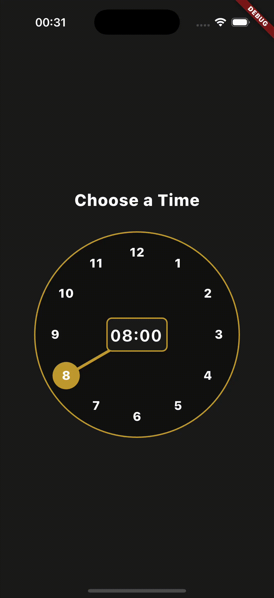

# Clock Picker in Flutter

## Background

Until the last moment, I was 100% sure that there was a library on pub.dev for Flutter that would allow us to implement this functionality. Unfortunately, that was not the case.

If you ask ChatGPT for help, you will only get the names of non-existent libraries.

So, the only option was to implement it myself.

I hope this code helps you accomplish your task.

**IF THIS CODE HELPED YOU – DON'T FORGET TO GIVE IT A STAR!** ⭐

-----------------------

## коротка передісторія

До останнього моменту я був на 100% впевнений, що на pub.dev є бібліотека для Flutter, яка дозволить нам реалізувати цей функціонал. Але, на жаль, це було не так.

Якщо ви звернетеся за допомогою до ChatGPT, то отримаєте лише назви неіснуючих бібліотек.

Тому єдиний варіант – реалізувати це самостійно.

Сподіваюся, цей код допоможе вам виконати ваше завдання.

**Якщо цей код став Вам у нагоді – не забудьте поставити зірочку!** ⭐

### Clock Picker Preview

## Keywords
clock picker, time picker, hour picker, flutter time selector, custom time picker, flutter clock component, time input, UI time picker
